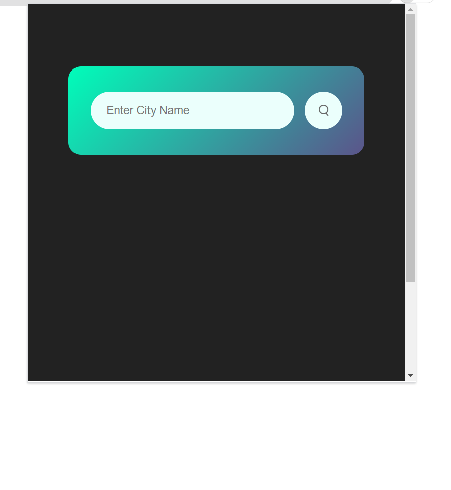
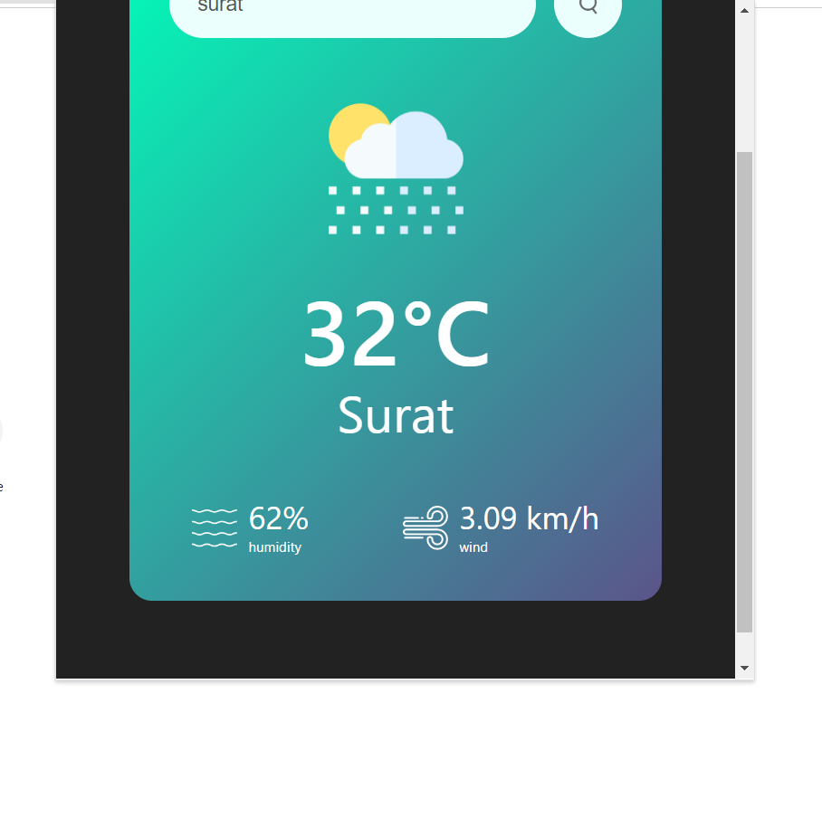

# Weather Forecast Google Chrome Extension
This Google Chrome Extension provides real-time weather data, including temperature, humidity, and wind speed based on the user's entered city. It utilizes HTML, CSS, and JavaScript to create a seamless user experience.

## Project Demo

## Table of Contents
Features
Installation
Usage
Contribution
License
## Features
Integrated a weather API to fetch real-time weather data for a specified city.
Displays temperature, humidity, and wind speed for the chosen city.
Implemented secure methods to hide the API link and key.
## Installation
Clone or download the repository to your local machine.
Open Google Chrome and go to chrome://extensions/.
Enable the "Developer mode" using the toggle switch in the top-right corner.
Click on the "Load unpacked" button and select the folder containing the extension files.
## Usage
Once the extension is installed, click on the extension icon in the browser.
Enter the city for which you want to get the weather information.
The extension will fetch real-time weather data and display temperature, humidity, and wind speed for the specified city.